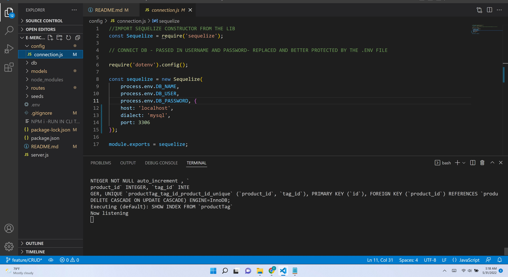

# Title
## e-merch-back-end
Integrate an existing Express.js API with Sequelize to interact with a MySQL database.

## Overview 
>A back end for an e-commerce site that has outgrown its current architecture.

## Contents
* [Title](#title),
* [Overview](#overview),
* [Table of Contents](#contents),
* [Description](#description),
* [Installation](#installation),
* [Notes](#notes),
* [Usage](#usage),
* [Credits](#credits),
* [License](#license),
* [Badges](#badges),
* [Features](#features),
* [Contribute](#contribute),
* [Tests](#tests)

## Description of Use and Criteria
> GIVEN a functional Express.js API
WHEN I add my database name, MySQL username, and MySQL password to an environment variable file
THEN I am able to connect to a database using Sequelize
WHEN I enter schema and seed commands
THEN a development database is created and is seeded with test data
WHEN I enter the command to invoke the application
THEN my server is started and the Sequelize models are synced to the MySQL database
WHEN I open API GET routes in Insomnia for categories, products, or tags
THEN the data for each of these routes is displayed in a formatted JSON
WHEN I test API POST, PUT, and DELETE routes in Insomnia
THEN I am able to successfully create, update, and delete data in my database
>

## Installation
1) Download and Install [MySQL](https://www.mysql.com/)
2) Download and Install [Sequelize](https://sequelize.org/)
3) Download and Install [Insomnia](https://insomnia.rest/)

## Usage

* **Start the application by typing node server.js**
* Click on the image to watch the video!
* 

* [GitHub Repo for e-merch-back-end](https://github.com/ChristiLewis/e-merch-back-end)

## Credits
* [UM Coding Bootcamp](https://bootcamp.miami.edu/coding/)
* [ChristiLewis](https://github.com/ChristiLewis)

## License
* All projects administered by the UM Bootcamp are to be considered under a general MIT license umbrella.
  
## Badges
* There are no badges at this time.

## Features
* MySQL, sequelize and Insomnia API route testing

## Contribute
* We are open to contributions, please contact the student, ChristiLewis.

## Tests
* JEST based TTD project.

## Contact
* [Contact Me](clc@xxxxxxx.com)
